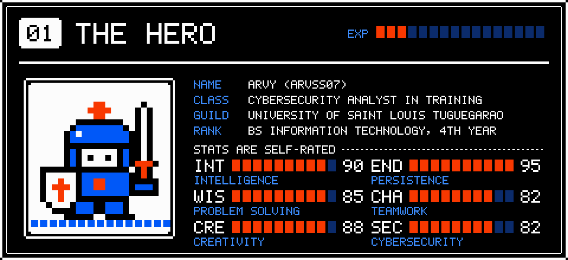
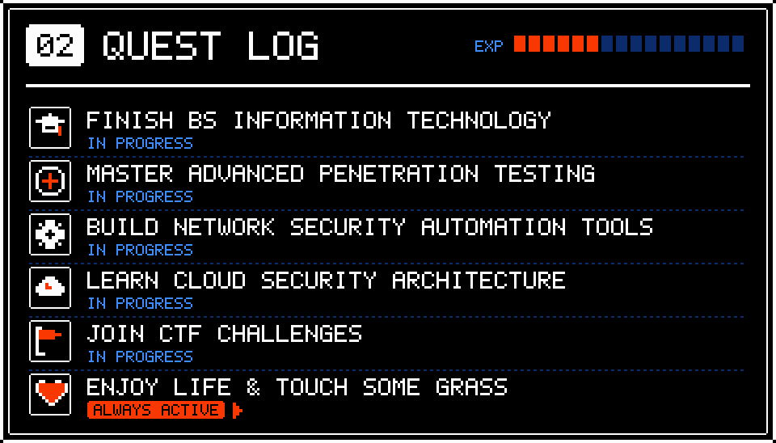
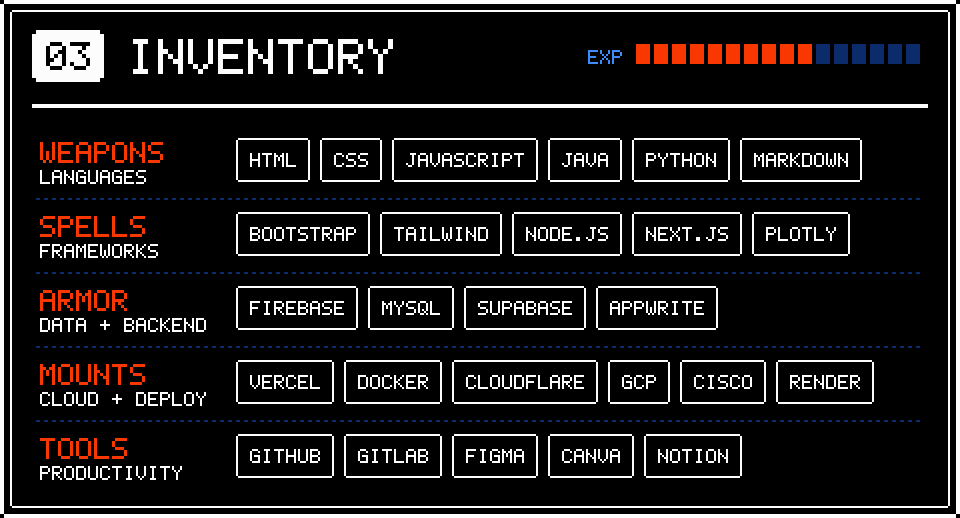
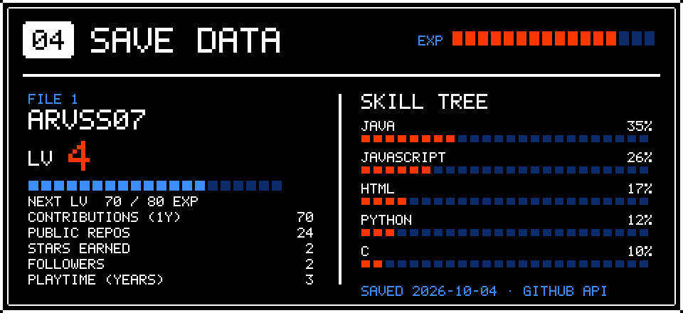
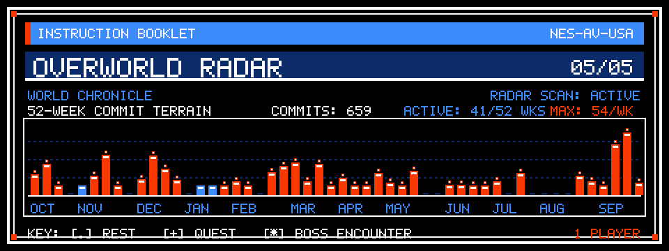
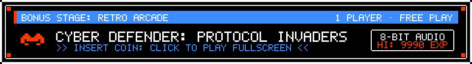

<!--
  ARVSS07: A Cybersecurity Adventure
  Instruction Booklet Edition (NES 8-bit Pixel Theme)
  Crafted with Impeccable standards for GitHub Profile.
  Data source: data/profile.json (rebuild via `node scripts/build-assets.mjs`)
-->

<!-- COVER -->
<picture>
  <source media="(prefers-color-scheme: dark)" srcset="assets/cover.svg">
  <source media="(prefers-color-scheme: light)" srcset="assets/cover.svg">
  
</picture>

<!-- CONTROLLER ACTION BUTTONS (DIRECT CONTACT) -->

  
  &nbsp;&nbsp;
  

<!-- PAGE 01: THE HERO (CHARACTER SHEET) -->
<picture>
  <source media="(prefers-color-scheme: dark)" srcset="assets/hero-dark.svg">
  <source media="(prefers-color-scheme: light)" srcset="assets/hero-light.svg">
  
</picture>

<!-- PAGE 02: QUEST LOG (CURRENT FOCUS & OBJECTIVES) -->
<picture>
  <source media="(prefers-color-scheme: dark)" srcset="assets/quests-dark.svg">
  <source media="(prefers-color-scheme: light)" srcset="assets/quests-light.svg">
  
</picture>

<!-- PAGE 03: INVENTORY (TECH STACK & GEAR) -->
<picture>
  <source media="(prefers-color-scheme: dark)" srcset="assets/inventory-dark.svg">
  <source media="(prefers-color-scheme: light)" srcset="assets/inventory-light.svg">
  
</picture>

<!-- PAGE 04: SAVE DATA (LIVE GITHUB TELEMETRY & SKILL TREE) -->
<picture>
  <source media="(prefers-color-scheme: dark)" srcset="assets/save-dark.svg">
  <source media="(prefers-color-scheme: light)" srcset="assets/save-light.svg">
  
</picture>

<!-- PAGE 05: OVERWORLD RADAR (52-WEEK COMMIT TERRAIN) -->
<picture>
  <source media="(prefers-color-scheme: dark)" srcset="assets/graph-dark.svg">
  <source media="(prefers-color-scheme: light)" srcset="assets/graph-light.svg">
  
</picture>

<!-- BONUS STAGE: PLAYABLE RETRO ARCADE -->
<a href="https://arvss07.github.io/Arvss07/" target="_blank" title="Press Start: Play Cyber Defender Arcade Mini-Game in browser">
  <picture>
    <source media="(prefers-color-scheme: dark)" srcset="assets/arcade-dark.svg">
    <source media="(prefers-color-scheme: light)" srcset="assets/arcade-light.svg">
    
  </picture>
</a>

<!-- CONTINUE SCREEN -->
<picture>
  <source media="(prefers-color-scheme: dark)" srcset="assets/continue.svg">
  <source media="(prefers-color-scheme: light)" srcset="assets/continue.svg">
  
</picture>

 

📜 <b>Text-Only Character Sheet & Transcript (Screen Readers & Scrapers)</b>

### Character Dossier
- **Name:** Arvy (Arvss07)
- **Role:** Aspiring Cybersecurity Analyst & Network Security Engineer
- **Education:** 4th-Year BS in Information Technology, University of Saint Louis Tuguegarao
- **Direct Contact:**
  - 💼 [LinkedIn Profile](https://www.linkedin.com/in/arvss07)
  - 📧 [E-mail](mailto:aggabaoarvy072004@gmail.com)

### Active Quests & Milestones
- 🎓 Finish BS Information Technology
- 🎯 Master Advanced Penetration Testing
- ⚙️ Build Network Security Automation Tools
- ☁️ Learn Cloud Security Architecture
- 🚩 Join CTF Challenges
- ❤️ Enjoy Life & Touch Some Grass

### Inventory & Technologies
- **Languages:** HTML, CSS, JavaScript, Java, Python, Markdown
- **Frameworks & Libraries:** Bootstrap, Tailwind, Node.js, Next.js, Plotly
- **Databases & Backend:** Firebase, MySQL, Supabase, Appwrite
- **Cloud & Deployment:** Vercel, Docker, Cloudflare, Google Cloud Platform (GCP), Cisco, Render
- **Productivity & Dev Tools:** GitHub, GitLab, Figma, Canva, Notion

### 🕹️ Bonus Stage: Retro Arcade Mini-Game
- **Game:** [Cyber Defender: Protocol Invaders](https://arvss07.github.io/Arvss07/)
- **Mission:** Guard the firewall from DDoS floods and malicious packet bugs in an authentic 8-bit web canvas arcade!

